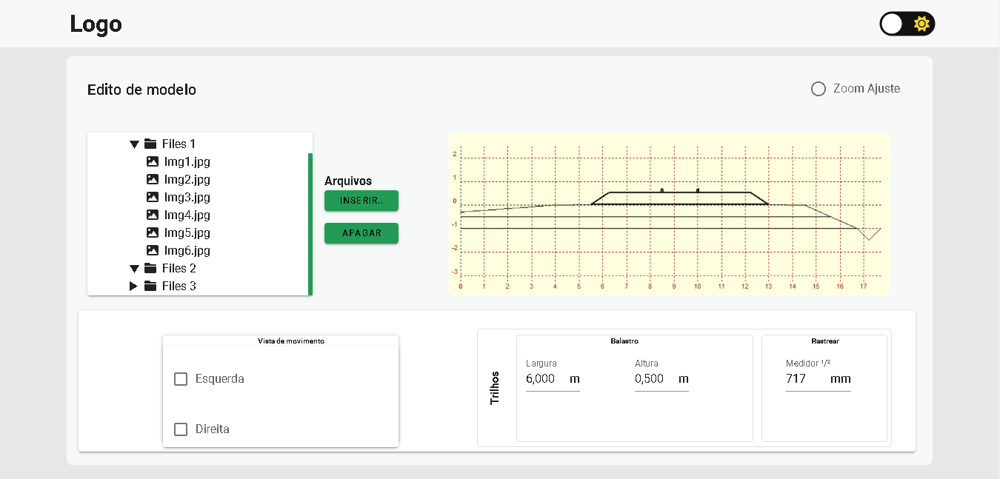
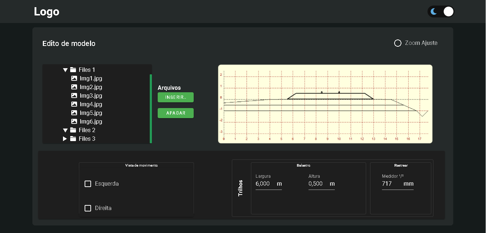

# Project Hap-engenharia 

## Resumo 

Esse é um projeto do desafio tech para o processo seletivo da Hap-engenharia o projeto é fazer um formulário para edição de um gráfico de uma seção transversal de via feria.

## Bibliotecas e Frameworks

* Vue.js --version (^2.6.14)
* Vuetify --version (^2.6.0)
* Vuex --version (^3.6.2)
* fortawesome --version (^6.0.0)
* @vue/cli-service --version (~5.0.0)

#

### Tema Claro

### Tema Escuro

